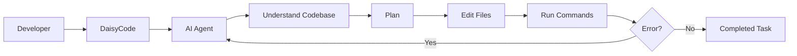

# DaisyCode


DaisyCode is a free and open AI coding workspace designed as an alternative to OpenCode. It lets developers build, modify, debug, and understand software using natural language while focusing on free AI models.

No mandatory authentication. No payments. No subscriptions.

## Features

- AI coding agent for natural-language development
- Understands existing codebases
- Creates and edits files
- Runs terminal commands
- Debugs and fixes errors
- Iterates on implementation
- Free AI model support
- No OpenAI or Claude dependency
- No payment system
- No mandatory authentication
- Developer-focused coding workspace
- Model selection and agent workflow

## How It Works



The agent can inspect a project, understand the existing implementation, make changes, run commands, analyze errors, and iterate until the requested task is completed.

## Free Models

DaisyCode is designed to work with free model providers instead of requiring paid OpenAI or Claude APIs.

Examples include free OpenCode models such as:

```
opencode/deepseek-v4-flash-free
opencode/mimo-v2.5-free
opencode/nemotron-3-ultra-free
opencode/laguna-s-2.1-free
opencode/big-pickle
```

Model availability depends on the provider and can change over time.

## How AO Was Used

DaisyCode was built as a solo project for the AO Hackathon using Agent Orchestrator.

AO was used throughout development for:

- Project planning
- Repository exploration
- Feature implementation
- File creation and editing
- Debugging
- Running commands
- Testing
- UI iteration
- Fixing development errors

AO was therefore part of the actual development process, not just included as a demonstration.

## Tech Stack

- React
- TypeScript
- Bun
- PostgreSQL
- Neon
- OpenCode free models
- Agent Orchestrator
- Git

## Project Structure

```
daisycode/
├── packages/
│   ├── database/
│   ├── server/
│   └── ...
├── .env.example
├── package.json
├── bun.lock
└── README.md
```

## Run Locally

### 1. Clone

```bash
git clone https://github.com/Anurag13075/daisycode.git
cd daisycode
```

### 2. Install dependencies

```bash
bun install
```

### 3. Create environment file

**Windows (PowerShell):**
```powershell
Copy-Item .env.example .env
```

**macOS/Linux:**
```bash
cp .env.example .env
```

### 4. Configure `.env`

```env
API_URL=http://localhost:3000
DATABASE_URL="your-postgresql-connection-string"
OPENCODE_API_KEY=
```

- Add your PostgreSQL connection string to `DATABASE_URL`.
- `.env.example` is only a template — the application reads values from `.env`.

### 5. Start the server

```bash
bun run dev:server
```

The development server runs on:

```
http://localhost:3000
```

## Troubleshooting

**`DATABASE_URL` is not set**

Make sure `.env` exists and contains:

```env
DATABASE_URL="your-postgresql-connection-string"
```

**Port 3000 is already in use**

Windows:
```powershell
netstat -ano | findstr :3000
taskkill /PID <PID> /F
```

Then restart:
```bash
bun run dev:server
```

## Security

Never commit `.env` or expose database credentials and API keys.

```
.env
.env.local
```

should remain private.

## Future Improvements

- More free model providers
- Local models through Ollama
- Better repository indexing
- Git integration
- Automated testing
- Multiple agents
- MCP support
- Improved agent permissions
- Better context management

## Links

- GitHub: [github.com/Anurag13075/daisycode](https://github.com/Anurag13075/daisycode)
- X: [@AnuragShar74342](https://x.com/AnuragShar74342/status/2087897945320665182)

## Author

**Anurag Sharma**

DaisyCode was built independently as a solo project for the AO Hackathon.

DaisyCode's goal is simple: open your project, describe what you want to build, and let a free AI coding agent help you ship it.
