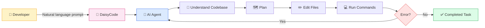
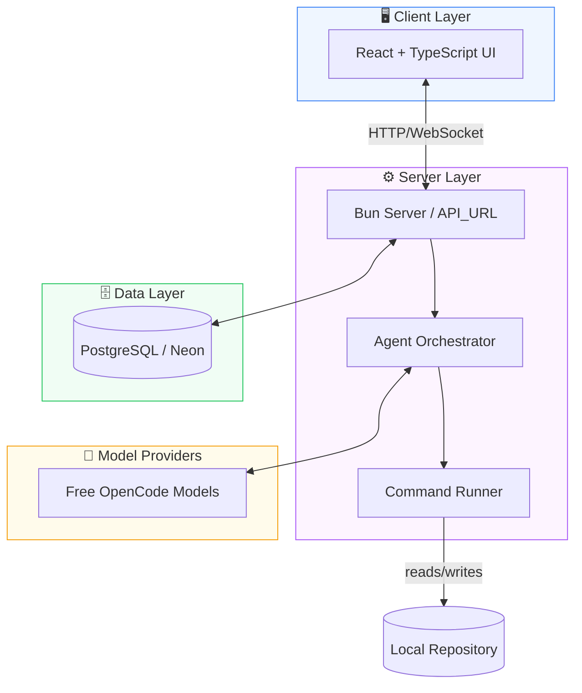
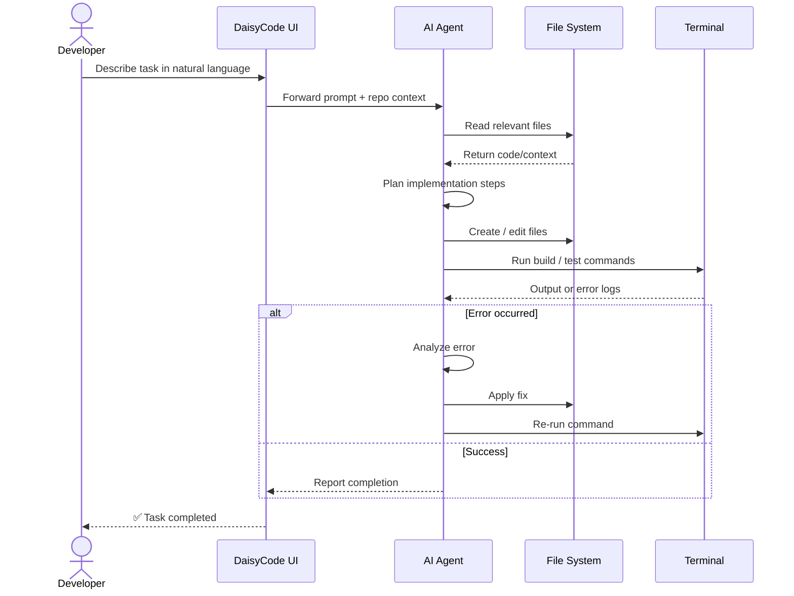
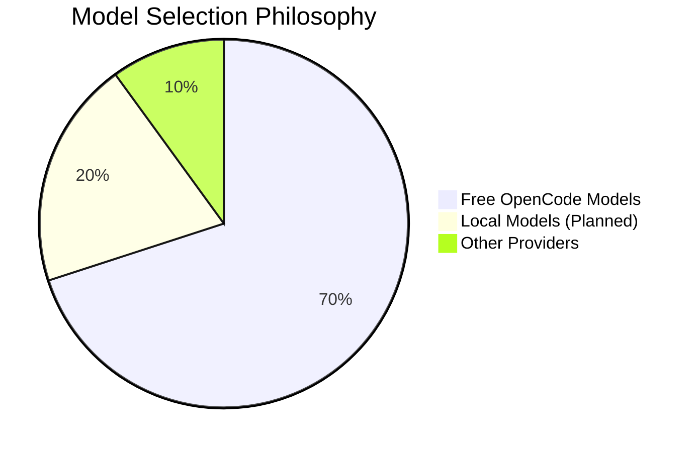
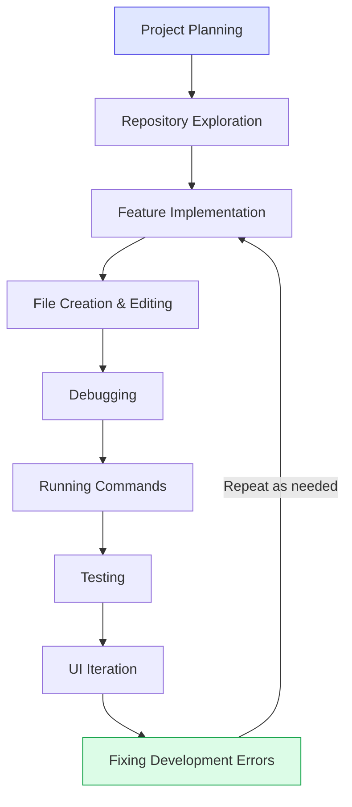
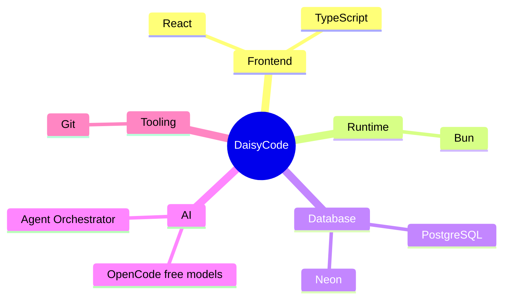
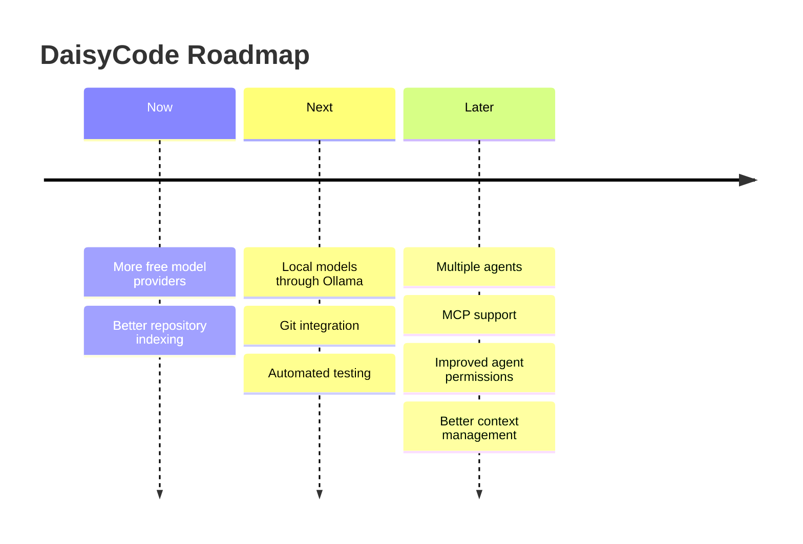

<div align="center">

# 🌼 DaisyCode

**A free, open AI coding workspace — built as an alternative to OpenCode.**

Build, modify, debug, and understand software using natural language, powered by free AI models.

No mandatory authentication. No payments. No subscriptions.


[](https://bun.sh)
[](https://www.typescriptlang.org/)
[](https://react.dev)
[](https://www.postgresql.org/)
[](#)
[](#)

</div>

---

## 📚 Table of Contents

- [Features](#-features)
- [How It Works](#-how-it-works)
- [System Architecture](#-system-architecture)
- [Agent Workflow](#-agent-workflow-sequence)
- [Free Models](#-free-models)
- [How AO Was Used](#-how-ao-was-used)
- [Tech Stack](#-tech-stack)
- [Project Structure](#-project-structure)
- [Run Locally](#-run-locally)
- [Troubleshooting](#-troubleshooting)
- [Security](#-security)
- [Roadmap](#-roadmap)
- [Links](#-links)
- [Author](#-author)

---

## ✨ Features

| Category | Capability |
|---|---|
| 🧠 AI Agent | Natural-language driven development |
| 🔍 Codebase Awareness | Understands existing project structure and logic |
| ✏️ File Operations | Creates and edits files directly |
| 💻 Terminal Access | Runs commands as part of the workflow |
| 🐛 Debugging | Detects, analyzes, and fixes errors |
| 🔁 Iteration | Repeats plan → act → verify until the task is done |
| 💸 Free Models | No OpenAI or Claude dependency required |
| 🔓 No Lock-in | No payment system, no mandatory authentication |
| 🛠️ Developer-First | Built for real coding workspaces, not demos |
| 🎛️ Flexible | Model selection and configurable agent workflow |

---

## 🧭 How It Works



The agent inspects a project, understands the existing implementation, makes changes, runs commands, analyzes errors, and iterates until the requested task is completed — without needing constant hand-holding.

---

## 🏗️ System Architecture



---

## 🔄 Agent Workflow (Sequence)



---

## 🆓 Free Models

DaisyCode is designed to work with free model providers instead of requiring paid OpenAI or Claude APIs.



Examples include free OpenCode models such as:

```
opencode/deepseek-v4-flash-free
opencode/mimo-v2.5-free
opencode/nemotron-3-ultra-free
opencode/laguna-s-2.1-free
opencode/big-pickle
```

> Model availability depends on the provider and can change over time.

---

## 🤝 How AO Was Used

DaisyCode was built as a solo project for the **AO Hackathon** using **Agent Orchestrator**.



AO was part of the **actual development process**, not just included as a demonstration — it was used throughout for planning, exploration, implementation, debugging, and iteration.

---

## 🧰 Tech Stack



---

## 📁 Project Structure

```
daisycode/
├── packages/
│   ├── database/
│   ├── server/
│   └── ...
├── .env.example
├── package.json
├── bun.lock
└── README.md
```

---

## 🚀 Run Locally

### 1. Clone

```bash
git clone https://github.com/Anurag13075/daisycode.git
cd daisycode
```

### 2. Install dependencies

```bash
bun install
```

### 3. Create environment file

**Windows (PowerShell):**
```powershell
Copy-Item .env.example .env
```

**macOS/Linux:**
```bash
cp .env.example .env
```

### 4. Configure `.env`

```env
API_URL=http://localhost:3000
DATABASE_URL="your-postgresql-connection-string"
OPENCODE_API_KEY=
```

- Add your PostgreSQL connection string to `DATABASE_URL`.
- `.env.example` is only a template — the application reads values from `.env`.

### 5. Start the server

```bash
bun run dev:server
```

The development server runs on:

```
http://localhost:3000
```

---

## 🛠️ Troubleshooting

**`DATABASE_URL` is not set**

Make sure `.env` exists and contains:

```env
DATABASE_URL="your-postgresql-connection-string"
```

**Port 3000 is already in use**

Windows:
```powershell
netstat -ano | findstr :3000
taskkill /PID <PID> /F
```

Then restart:
```bash
bun run dev:server
```

---

## 🔒 Security

Never commit `.env` or expose database credentials and API keys.

```
.env
.env.local
```

should remain private.

---

## 🗺️ Roadmap



- [ ] More free model providers
- [ ] Local models through Ollama
- [ ] Better repository indexing
- [ ] Git integration
- [ ] Automated testing
- [ ] Multiple agents
- [ ] MCP support
- [ ] Improved agent permissions
- [ ] Better context management

---

## 🔗 Links

- **GitHub:** [github.com/Anurag13075/daisycode](https://github.com/Anurag13075/daisycode)
- **X (Twitter):** [@AnuragShar74342](https://x.com/AnuragShar74342/status/2087897945320665182)

---

## 👤 Author

**Anurag Sharma**

DaisyCode was built independently as a solo project for the AO Hackathon.

> Open your project, describe what you want to build, and let a free AI coding agent help you ship it.

<div align="center">

**⭐ If you find this project useful, consider starring it on GitHub ⭐**

</div>
